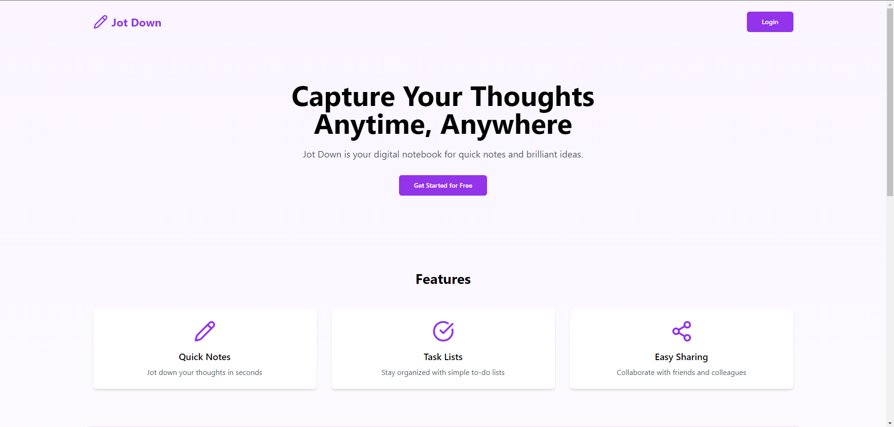
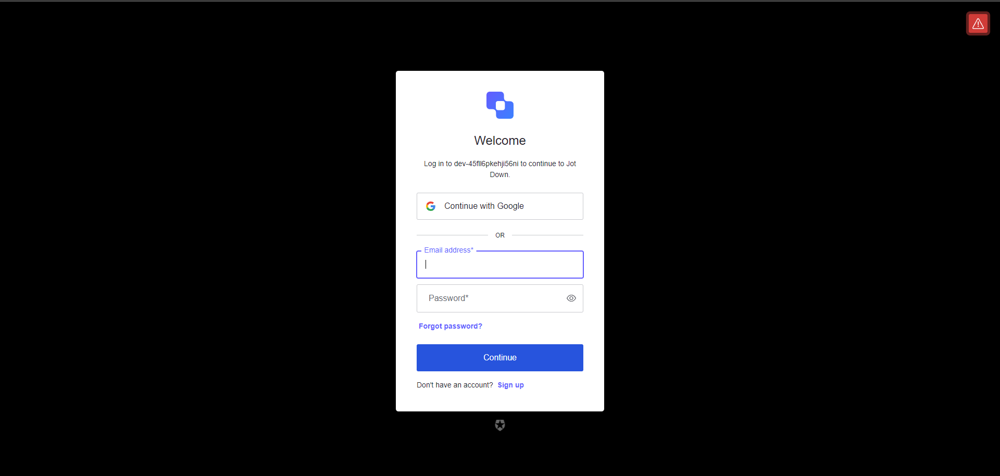
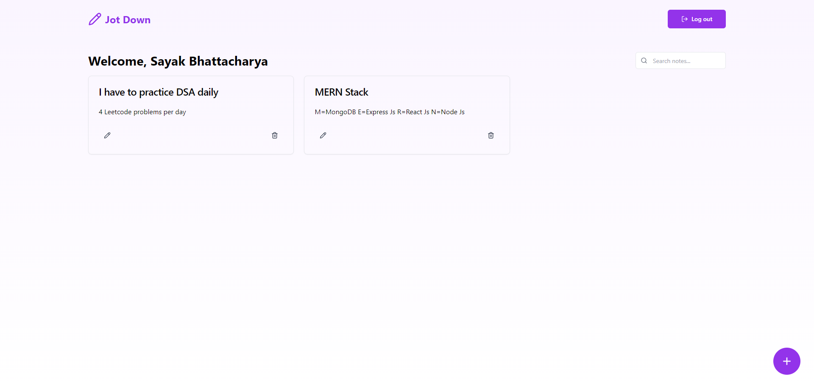
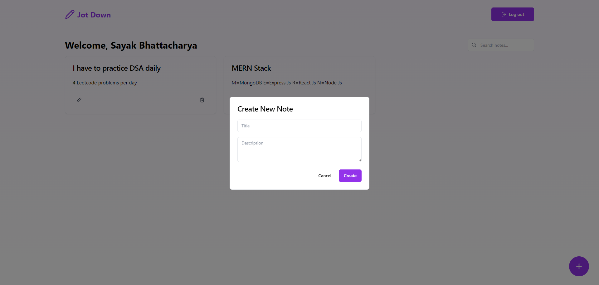

# Jot Down: A Note-Taking Web App

Jot Down is a modern, responsive web application for capturing and managing your thoughts, ideas, and to-do lists. With a sleek user interface and powerful features, Jot Down makes it easy to create, read, update, and delete notes from any device.

## Live Demo

Check out the live version of Jot Down: [https://jot-down-bsayak03.vercel.app/](https://jot-down-bsayak03.vercel.app/)

## Features

- **Quick Notes**: Jot down your thoughts in seconds
- **Task Lists**: Stay organized with simple to-do lists
- **Easy Sharing**: Collaborate with friends and colleagues
- **Responsive Design**: Access your notes on any device
- **Secure Authentication**: User authentication powered by Auth0
- **Real-time Syncing**: Your notes are saved and synced automatically

## Screenshots

[Add screenshots of your application here. For example:]






## Demo Video

[Add a link to or embed a demo video of your application here. For example:]

<!-- [](https://youtu.be/your-video-id) -->

## Technologies Used

- **Frontend**: React.js with Vite
- **Backend**: Node.js with Express.js
- **Database**: MongoDB
- **Authentication**: Auth0 by Okta
- **Styling**: Tailwind CSS
- **UI Components**: shadcn/ui
- **Animations**: Framer Motion
- **Icons**: Lucide React

## Prerequisites

Before you begin, ensure you have met the following requirements:

- Node.js (v14 or later)
- npm or yarn
- MongoDB
- Auth0 account

## Installation

1. Clone the repository:

   ```
   git clone https://github.com/bsayak03/Jot-Down.git
   cd Jot-Down
   ```

2. Install dependencies for both frontend and backend:

   ```
   # Install backend dependencies
   cd backend
   npm install

   # Install frontend dependencies
   cd ../frontend
   npm install
   ```

## Running the Application

1. Start the backend server:

   ```
   cd backend
   npm start
   ```

2. In a new terminal, start the frontend development server:

   ```
   cd frontend
   npm run dev
   ```

3. Open your browser and navigate to `http://localhost:5173` to view the Vite application.

## Contributing

Contributions to Jot Down are welcome! Please feel free to submit a Pull Request.

## License

This project is licensed under the MIT License - see the [LICENSE.md](LICENSE.md) file for details.

## Acknowledgements

- [Auth0](https://auth0.com/) for providing secure authentication
- [shadcn/ui](https://ui.shadcn.com/) for beautiful UI components
- [Framer Motion](https://www.framer.com/motion/) for smooth animations
- [Lucide](https://lucide.dev/) for the icon set

## Contact

If you have any questions or feedback, please contact:

Sayak Bhattacharya - Email: sayakofficial21@gmail.com or GitHub: [bsayak03](https://github.com/bsayak03)

Project Link: [https://github.com/bsayak03/Jot-Down](https://github.com/bsayak03/Jot-Down)
